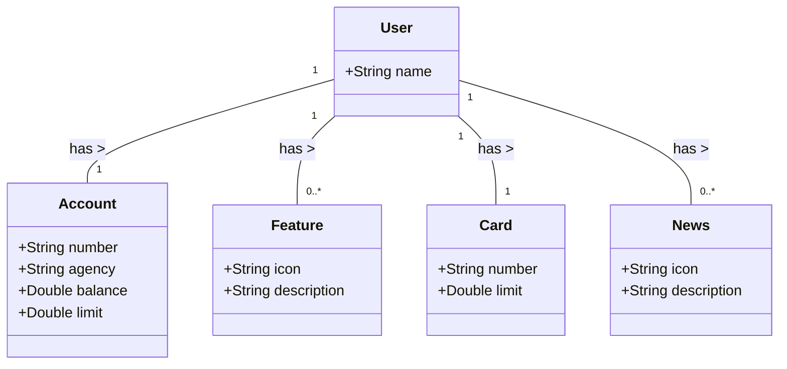

# Desafio Dio Api na Nuvem
Java RESTful API criada para o desafio Publicando Sua API REST na Nuvem Usando Spring Boot 3, Java 17 e Railway da DIO.

## Diagrama de Classe

```mermaid
classDiagram
    class User {
      +String name
    }
    class Account {
      +String number
      +String agency
      +Double balance
      +Double limit
    }
    class Feature {
      +String icon
      +String description
    }
    class Card {
      +String number
      +Double limit
    }
    class News {
      +String icon
      +String description
    }

    User "1" -- "1" Account : has >
    User "1" -- "0..*" Feature : has >
    User "1" -- "1" Card : has >
    User "1" -- "0..*" News : has >
```
